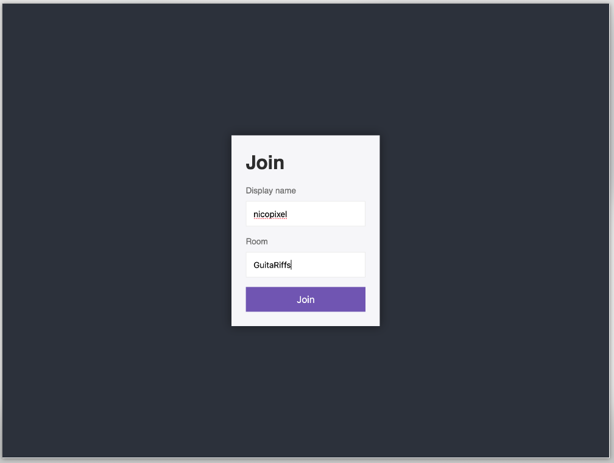
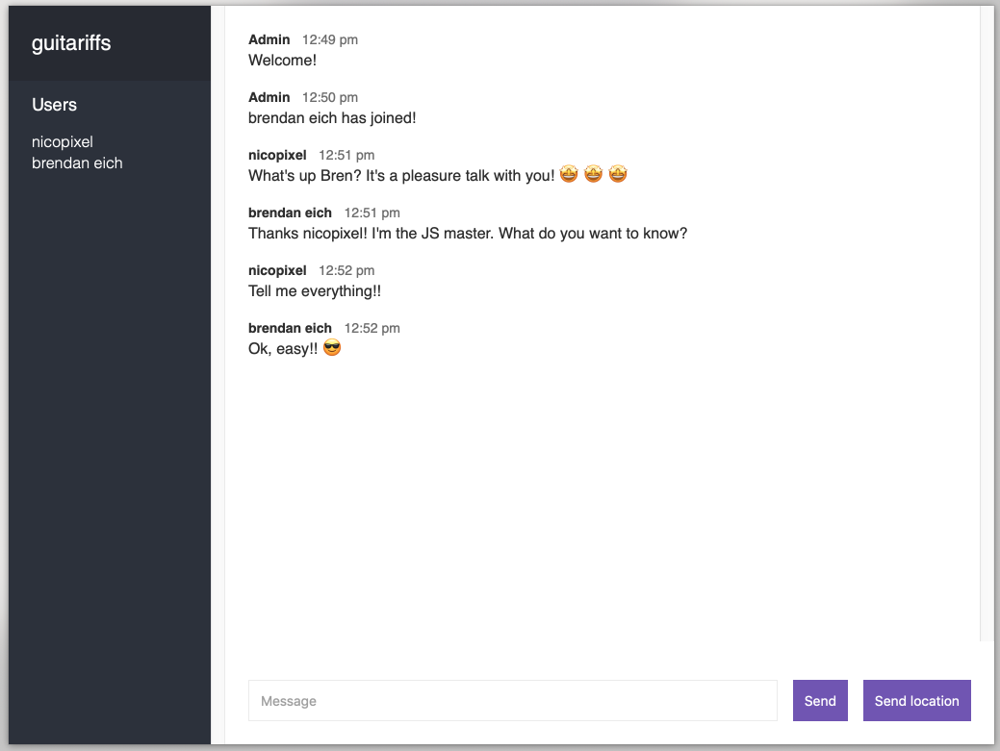

# Chat Socket

Welcome to **Chat Socket**, a real-time chat application built with [Socket.io](https://socket.io/), [Node.js](https://nodejs.org/en/), HTML, and JavaScript. This app provides a simple yet powerful way to communicate with others in designated chat rooms.

---

## [Live App](https://chat-lac-five.vercel.app/)
The application is deployed on **Netlify** for the frontend and **Heroku** for the server-side functionality. Click the link above to try it out live!

---

## Features

- **Room-based Chat**: Join a specific chat room by selecting a room name on the joining page.
- **Real-time Messaging**: Experience seamless communication powered by **Socket.io** for real-time interaction.
- **Location Sharing**: Easily share your current location with everyone in the chat room, leveraging the [Navigator API](https://developer.mozilla.org/en-US/docs/Web/API/Navigator).
- **Lightweight Frontend**: Built with pure HTML and [Mustache.js](https://github.com/janl/mustache.js) for templating—no frontend frameworks like React are used.
- **Robust Server-side**: Developed with [Node.js](https://nodejs.org/en/), [Express](https://expressjs.com/), and **Socket.io** for scalable backend functionality.

---

## How to Run the Application Locally

Follow these steps to set up and run the project on your local machine:

1. Clone the repository:
   ```bash
   git clone https://github.com/nicopixel/chat
   ```
2. Navigate to the project directory:
   ```bash
   cd chat
   ```
3. Install dependencies:
   ```bash
   yarn
   # OR
   npm install
   ```
4. Start the application:
   ```bash
   npm run start
   ```
5. Open the app in your browser at `http://localhost:3000`.

---

## Scripts

The project includes several npm scripts to streamline development and testing:

- **`npm run start`**: Run the application in production mode at `http://localhost:3000`.
- **`npm run develop`**: Start the app in development mode with **nodemon** for automatic restarts on file changes.
- **`npm run check`**: Analyze the code for errors and style issues using **ESLint**.
- **`npm run format`**: Format the codebase according to **Prettier** standards.

---

## Application Overview

### Joining Page



The joining page allows you to:
- Choose a **public nickname**.
- Select or create a **room** to join. Ensure you use the exact room name to enter an existing room.

---

### Chat Room



The chat room is the main interaction space where you can:
- Send messages to everyone in the room.
- Share your location with other participants using the **Navigator API**.

---

## Explore More Projects

Interested in more creative projects like this? Check out my [GitHub mini project list](https://github.com/stars/nicopixeldev/lists/mini-project).
