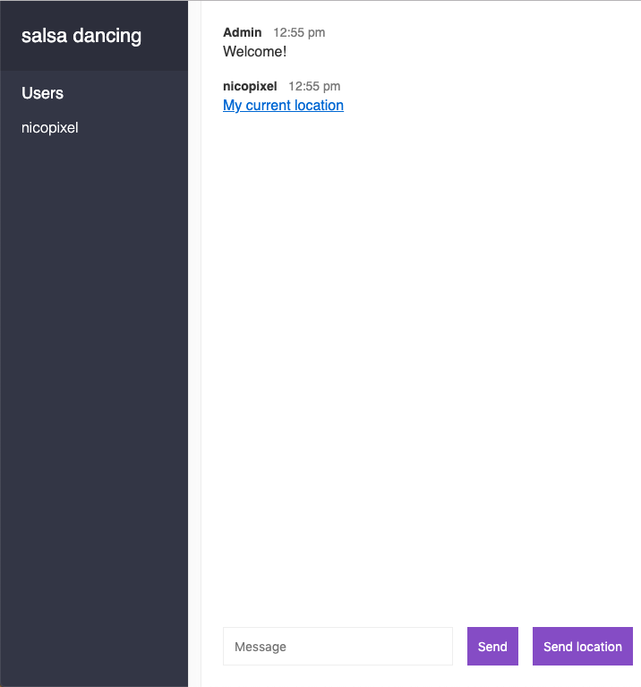

# Chat Socket
Chat sockets is a really simple app to learn the basis of sockets in the server and the client.
The application let you enter to any room you want and share the location with all the presents.

**npm run develop**: run the application in http://localhost:3000

### Joining Page

### Chat Room

### Share location

